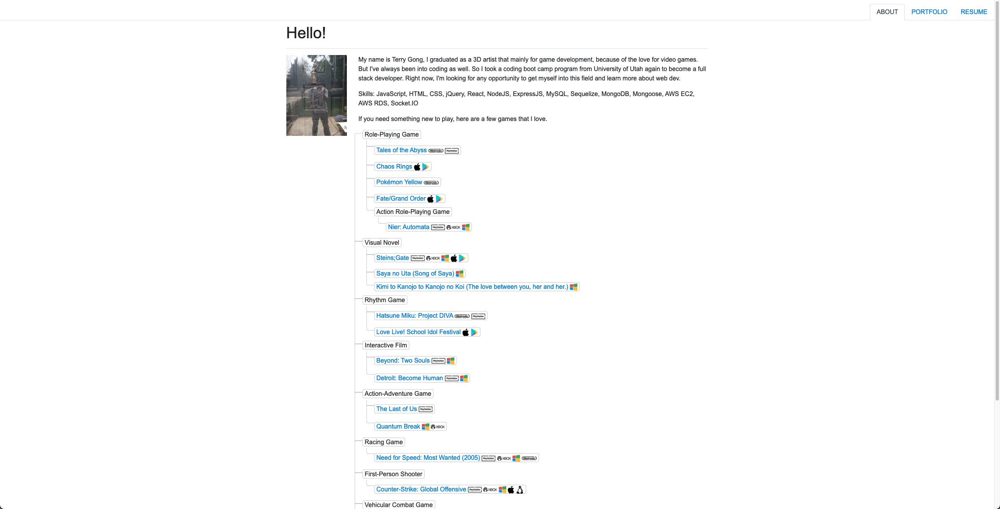

# Portfolio

- [About](#about)
- [Link](#link)
- [Screenshot](#screenshot)
- [License](#license)

## About
This is a updated version of my portfolio. Converted from HTML to React. 

## Link
[Portfolio](https://terry0532.github.io/React_Portfolio/)

## Screenshot

## License

[MIT License](LICENSE)